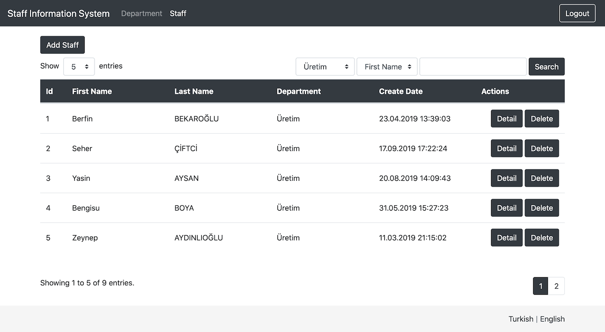
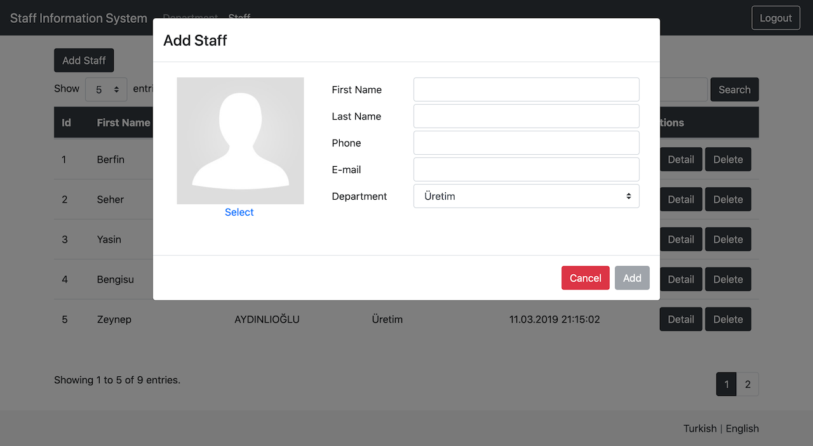

# Spring Boot Rest CRUD

This project is developed to practise on Spring Boot, Spring Rest, Spring Data, Spring Security and Angular Framework.

# Table Of Contents

- [Technologies Used](#technologies-used)
- [Features](#features)
- [Screenshots](#screenshots)
- [Launch](#launch)
- [Usage](#usage)

# Technologies Used

- Spring Boot
- Spring Data
- Spring Security
- Spring Rest
- Lombok
- Swagger
- JWT
- Hibernate
- Postgresql
- Angular
- Bootstrap
- JUnit
- Mockito

## Features

- Making staff and department releated CRUD operations.
- Adding, updating and deleting staff image.
- Listing staffs by department.
- Searching staff by first name, last name.
- Turkish and English language support.

# Screenshots

<a href="./screenshots/department-management-page.png">
	
</a>

<a href="./screenshots/add-department-dialog.png">
	
</a>

<a href="./screenshots/update-department-dialog.png">
	
</a>


<a href="./screenshots/staff-management-page.png">
	
</a>

<a href="./screenshots/add-staff-dialog.png">
	
</a>

<a href="./screenshots/staff-detail-dialog.png">
	
</a>

> **Staff names is not real names. They were randomly generated.**

# Launch

- To build and run project:

	```bash
	$ git clone https://github.com/erhantuncel/SpringBootRestCRUD.git
	$ cd SpringBootRestCRUD/backend
	$ mvn clean package -DskipTests
	$ cd ..
	$ docker-compose up
	```

# Usage

- You can access login page on [http://localhost:4200](http://localhost:4200) (**User Name:** admin, **Password:** 1234)
- You can access api endpoitns from [http://localhost:8080/swagger-ui.html](http://localhost:8080/swagger-ui.html)
